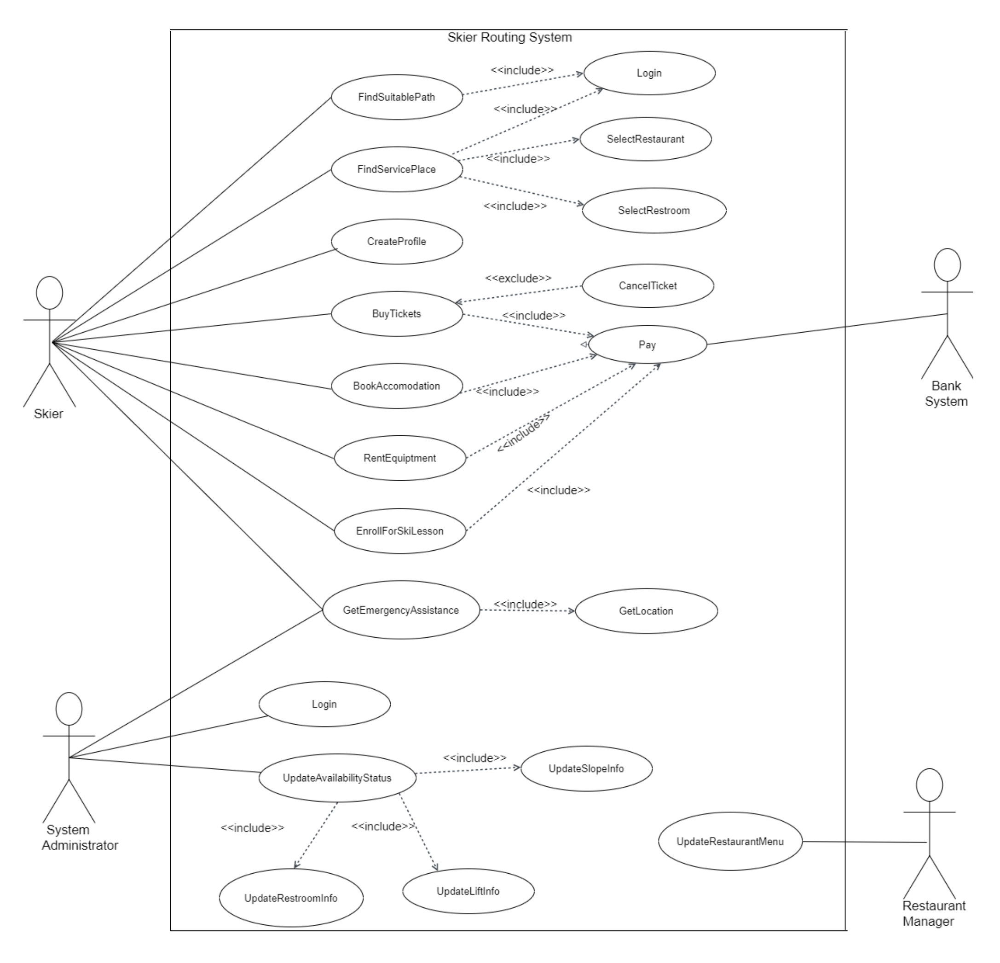
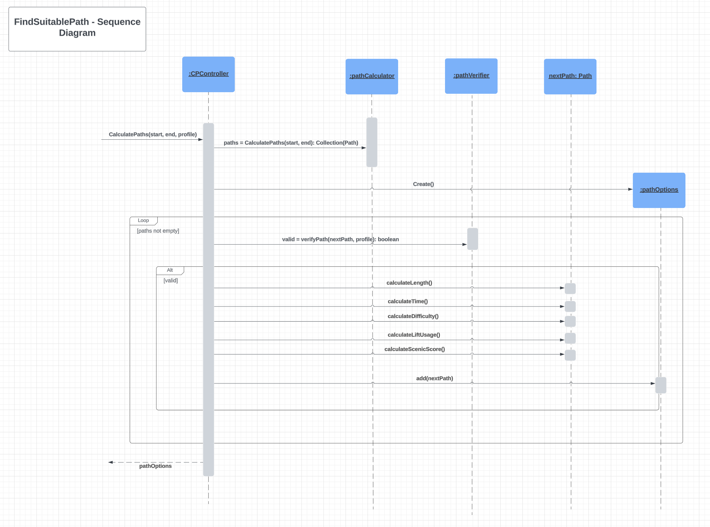
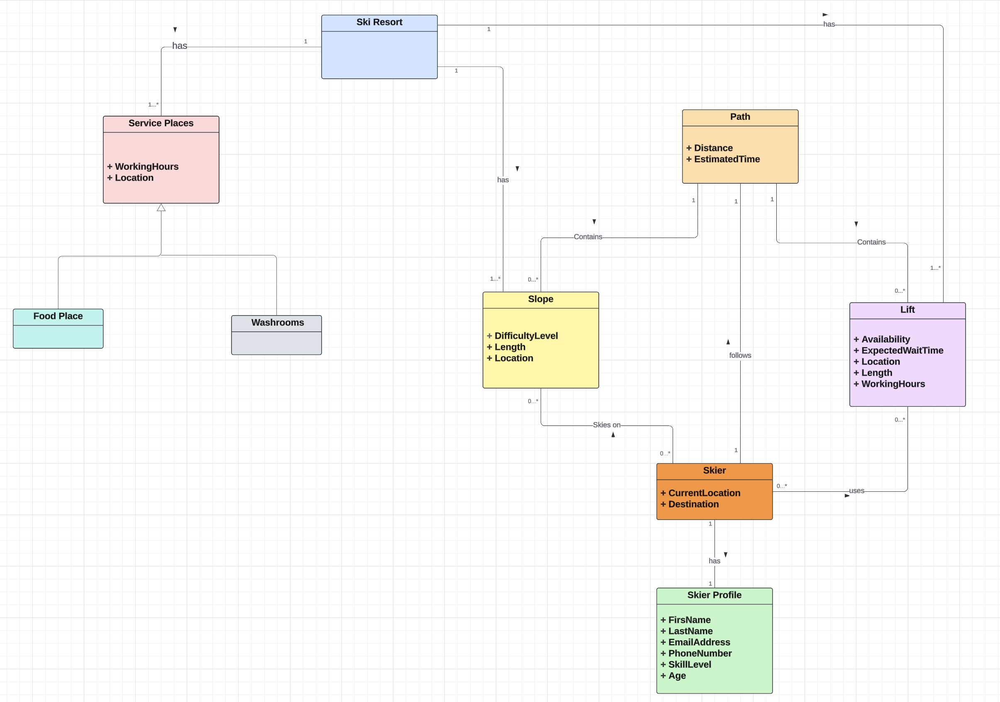
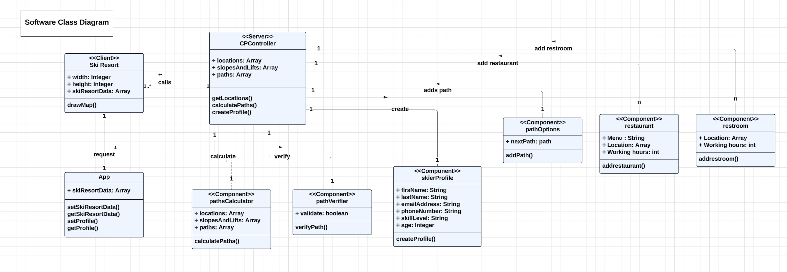

# Skier-Routing-App
A web app that helps skiers find their way in a ski resort

## **Skier-Routing-App**

This repository contains the code for a skier routing Application. Below is an overview of the project structure, including class diagrams and explanations of how the code works.

### **Summary:**

This is a group project to develop a pathfinding app for skiers at a ski resort. The application helps skiers navigate the ski area by providing optimal routes based on their starting point, ending point, and preferred slope difficulty level. This readme file outlines the project's development process and flow of events.

## Step-by-Step Design Process

1. **Use Case Diagram:**
The use case diagram represents the actors involved (skiers, administrators, and bank system) and their interactions with the app.
At first, we looked at the project as a complete project for a ski resort and we implemented parts of the use cases which were the main use cases. This diagram outlines the key functionalities of the whole project such as user login, finding suitable paths, and selling tickets.
 

     &nbsp; &nbsp; 
    
 &nbsp; &nbsp;

2. **Sequence Diagram:**
The sequence diagram visualizes the flow of interactions between the user and the system.
 
  
     &nbsp; &nbsp; 
    
 &nbsp; &nbsp;

3. **Domain Model Diagram:**
The domain model diagram illustrates the relationships between different entities in the application, such as Path, Slope, Skier, etc.
It helps clarify the structure and data flow within the application.
 
 
     &nbsp; &nbsp; 
    
 &nbsp; &nbsp;

4. **Class Diagram:**
The class diagram provides a detailed view of the classes and their relationships within the application.
It includes classes for Ski Resort, Calculate Path Controller(CPController), and the system, and shows how they interact with each other.
 
  
     &nbsp; &nbsp; 
    
 &nbsp; &nbsp;

### **Team:**
This project was developed by [Osama Nori](https://github.com/Harsual), [Parinaz Shiri](https://github.com/parinaz-shiri), [Reetika Satelkar](https://github.com/Reetika14), [Fiona Okezie](https://github.com/FionaOkezie), and [Jaspreet Singh](https://github.com/singhjaspreet97).

## Instruction on how to run the application

***IMPORTANT***

to run this app, the server must be run then the client. If Node js and npm are installed. The steps are as follows:

1- Access the server directory using the terminal and run npm run dev.

2- Access the client directory using a new terminal and run npm install first to get the modules and then npm start to start the project.

